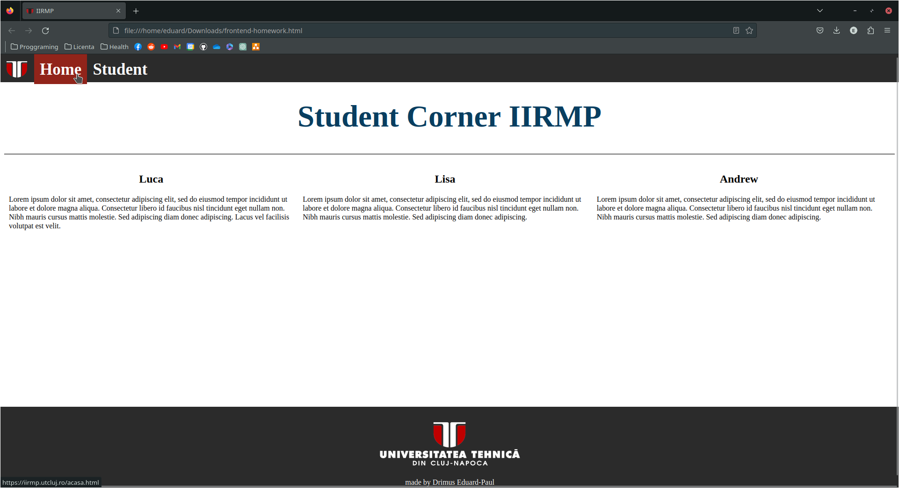

#  TUCN-programming-project

University project involving the development of a front-end HTML page with a navbar, three flex boxes containing text and headers, and a footer with logos and links. 

## Screenshots

Include screenshots or images related to your project here. You can either upload the images to your repository or provide URLs to the images hosted elsewhere. Use the following format to embed images:

## Description

Main purpose was to make it seem like it's a site where exchange students could tell their experience.

## Usage

How to use or run the project:

1. Clone this repository.
2. Open the `frontend-homework.html` file in a web browser.
3. Explore the project.

## Features

- Navbar with on-hover highlight
- Flexboxes with headers and text
- Links to university main page

## Technologies Used

HTML & CSS.

## Credits

Technical University of Cluj-Napoca

## License

This project is licensed under the [MIT License](LICENSE).

